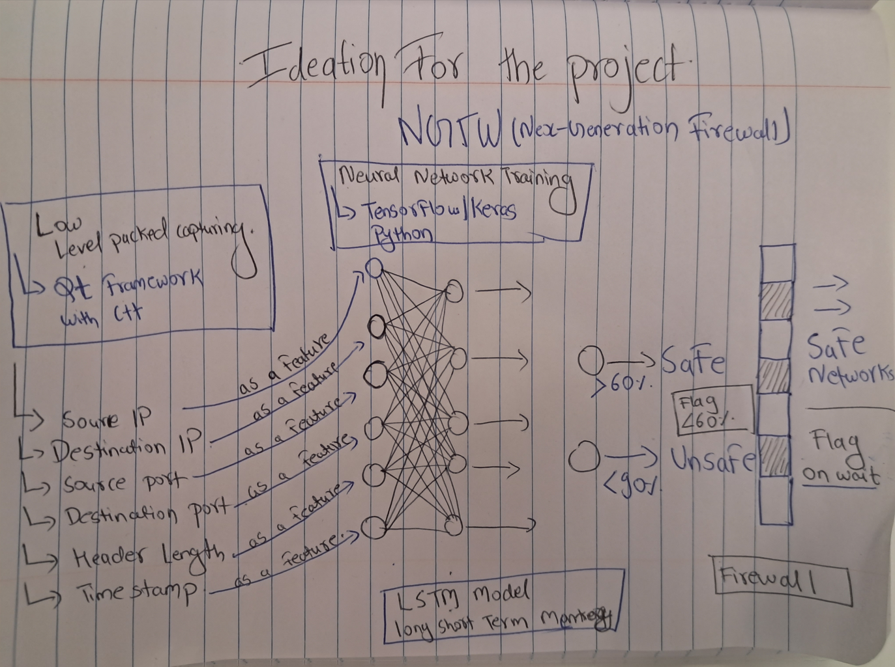
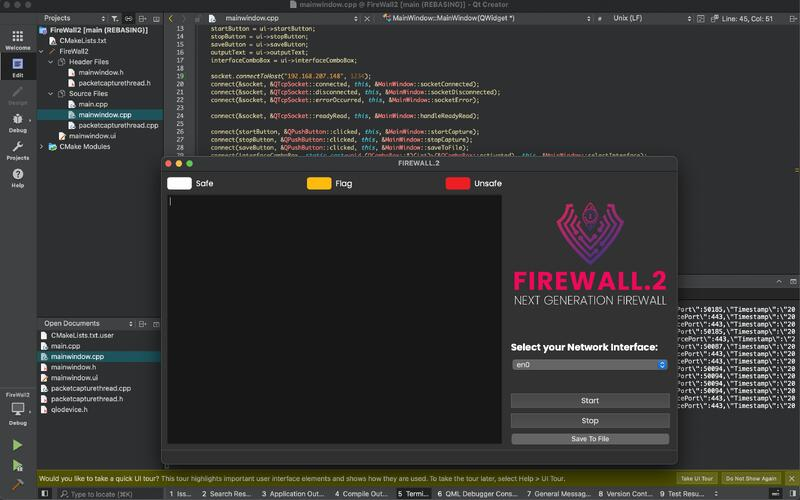

# FIREWALL.2: Next-Generation Firewall (NGFW) Prototype

## Introduction

FIREWALL.2 is a prototype of a Next-Generation Firewall (NGFW) that employs behavioral analysis of network traffic to dynamically set firewall rules. This project was developed in a fast-paced hackathon environment, making it more suitable for intermediate QT coders rather than beginners. 

This prototype represents a comprehensive approach to network security, integrating low-level networking capabilities, packet analysis, feature extraction, artificial intelligence (AI) decision-making, firewall rules enforcement, logging, and monitoring.



## Features

- **Networking Layer**: Capture and analyze network traffic packets using libraries like libpcap or WinPcap in QT/C++.
- **Packet Analysis**: Extract and dissect packet information such as source IP, destination IP, ports, and payload.
- **Feature Extraction**: Extract meaningful features from network packets for AI model input.
- **AI Decision-Making**: An AI neural network, developed in Python, decides whether to allow or block network traffic based on extracted features.
- **Firewall Rules**: Implement firewall rules in QT/C++ to enforce AI recommendations.
- **Logging and Monitoring**: Log and monitor network activities and firewall actions.

## Dependencies

To run this project, you need the following dependencies:

- **QT Framework**: Download and install QT from [QT Official Site](https://www.qt.io/download).
- **Libpcap/WinPcap**: Library for network traffic capture.
- **C++ Compiler**: Compatible with QT.
- **Python**: For the AI component (pytorch).

## Setup and Installation

1. **Fork the Repository**:
   - Go to the GitHub page of this repository and click on the "Fork" button to create your own copy.

2. **Clone the Repository**:
   - Clone the forked repository to your local machine:
     ```sh
     git clone https://github.com/kastuv/FireWall_Version2.git
     ```

3. **Install QT**:
   - Download and install QT from the [QT Official Site](https://www.qt.io/download).
   - Ensure that you have all the necessary components installed to run QT applications.

4. **Install Libpcap/WinPcap**:
   - For Linux:
     ```sh
     sudo apt-get install libpcap-dev
     ```
   - For Windows:
     - Download and install WinPcap from the [WinPcap Official Site](https://www.winpcap.org/).

## Running the Application

1. **Open the Project in QT**:
   - Open QT Creator and load the project file.

2. **Build the Project**:
   - Build the project using QT Creator to ensure all dependencies are linked correctly.

3. **Run the Application**:
   - Run the application from QT Creator.

4. **Select Network Interface**:
   - Select the network interface you want to monitor from the dropdown list in the GUI.

5. **Start Packet Capture**:
   - Click on the "Start" button to begin capturing network packets.

6. **Stop Packet Capture**:
   - Click on the "Stop" button to end the packet capture.

7. **Save Captured Packets**:
   - Click on the "Save" button to save the captured packets to a file.



## Code Overview

### PacketCaptureThread

Handles the packet capture logic using pcap library.

```cpp
class PacketCaptureThreadData : public QSharedData { /* ... */ };
PacketCaptureThread::PacketCaptureThread(const QString& deviceName, QObject* parent) { /* ... */ }
void PacketCaptureThread::run() { /* ... */ }
void PacketCaptureThread::stopCapture() { /* ... */ }
void PacketCaptureThread::setDeviceName(const QString& deviceName) { /* ... */ }
```

### MainWindow

Manages the GUI and integrates packet capturing with the AI model.

```cpp
MainWindow::MainWindow(QWidget *parent) { /* ... */ }
MainWindow::~MainWindow() { /* ... */ }
void MainWindow::startCapture() { /* ... */ }
void MainWindow::stopCapture() { /* ... */ }
void MainWindow::packetHandler(const struct pcap_pkthdr *header, const u_char *packetData) { /* ... */ }
void MainWindow::saveToFile() { /* ... */ }
void MainWindow::sendPacketDataToServer(const QByteArray &packetData) { /* ... */ }
void MainWindow::socketConnected() { /* ... */ }
void MainWindow::socketDisconnected() { /* ... */ }
void MainWindow::socketError(QAbstractSocket::SocketError error) { /* ... */ }
```

## Contributing

We welcome contributions to improve this project. If you have any suggestions or improvements, please create a pull request or open an issue.

## Contact

For any inquiries or support, please contact [kastuvpokharel@gmail.com].
